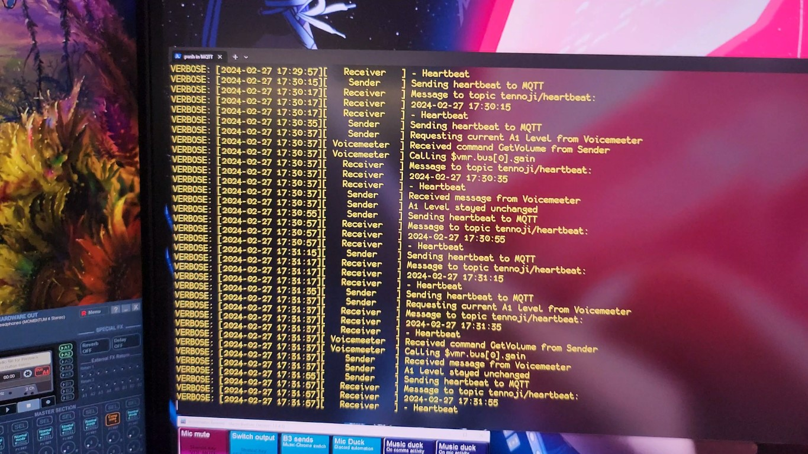

# MQTT shenanigans
I want locally control my main PC thru MQTT. You can find scripts for that here.

They depend on MQTTX cli client, which you can download from [MQTTX cli website](https://mqttx.app/cli#download)

## mqtt-handler.ps1
Utility running on my main computer running Windows 10. There's several parts:
* Main thread
* MQTT listener
* MQTT Sender
* Voicemeeter Potato handler
* Process Watcher

### Demo video
!! Contains "Hey Google, switch to speakers" !!

(click to open)

### What they do?
- Main thread handles the script output and thread lifecycling
- MQTT Listener parses whatever mqttx client spits out and reacts to the messages as needed
- MQTT Sender sends updates to topics listened by SmartThings virtual devices
- Voicemeeter Potato handler is handling all the Voicemeeter API calls and informs sender if user changed something (A1 volume or device)
- Process watcher triggers actions in SmartThings (utilising LAN Triggers) and Voicemeeter (changing MacroButtons button states) whenever watched process is running and stops

This is close integration with SmartThings and uses several utilities Todd Austin has programmed:
* [LAN Trigger](https://github.com/toddaustin07/lantrigger)
* [Edgebridge](https://github.com/toddaustin07/edgebridge)
* [MQTTDevices](https://github.com/toddaustin07/MQTTDevices)

Edgebridge and other half of LAN Trigger is running on my local raspberry pi. The rpi is also running [mosquitto](https://mosquitto.org/)

### Threads? Really?
Yes, mqttx client is literally just piping the output to data processor, which dictated it's own thread anyway to achieve any sensible two-way communications. This was inspiration to
dive deep into the threading as I haven't done it much - just to see how to do it if I ever need it at work. It also turned out that Voicemeeter API is slightly annoying, and threading
made that part slightly easier. First iteration used just jobs, but as those are invoking their own processes, that complicated the communications a little bit, making child jobs essentially
read-only and I wanted bi-directional communications between the threads. So, took one step deeper into .NET runspaces, thread-safe queues and synced hashtables. I'm avoiding the synced hashtable
in actual communications on purpose, as I also wanted to know how to handle single queue in multi-threaded environment.

### Ok, but what does it _do_?
First of all, only one thing relies on cloud, due to bad purchase. Everything else is handled locally and doesn't require internet.

It achieves several things:

* Automating light scenes
  * Uses LAN Triggers as Process Watcher is using this mainly
    * Separate triggers when process is detected running and when it stops
    * Also saves up device count - one LAN Trigger device in SmartThings can handle 19 different triggers, so, 19 scenes (selected by script so it could be really elaborate actually) or 9 on-off triggers with one spare trigger
  * When OBS is running, certain scene triggers so there's enough light to my face
  * When I'm using PS Remote Play or Geforce NOW, another scene triggers so there's minimal reflections to my display. Same scene is triggered when obs stops running - for now.
* Automating PC audio
  * Handling speaker power
    * I have active speakers, which are connected to smart outlet and if I'm listening with headphones, the power will be turned off. And back on when output is switched to speakers
    * The only integration requiring cloud and it's rather ":D" - MQTT changes virtual switch state, SmartThings hub syncs the state to cloud, Google notices the change and changes Tuya socket state accordingly, Tuya sends push message to outlets.
      * So: MQTT -> SmartThings Cloud -> Google Cloud -> Tuya Cloud -> Socket
      * The delay is still just around 1-3 seconds. Thanks Tuya for integrating with only Amazon and Google with this particular product 😩
      * Despite of that it's surprisingly robust, very rare state change misses.
  * Triggering MacroButtons
    * MQTT message can switch between headphones and speakers by triggering macrobutton loading correct Voicemeeter configuration
      * Dedicated handling due to button behaviour through API
    * The state and/or gate trigger of a button can be enabled or disabled (enabled state = pushed, latching)
    * Process watcher can lower music level when I'm playing and disable other triggers touching the level
    * Can handle multiple buttons with one payload (using array)
  * Enforcing maximum volume level between 21:30 - 08:00.
    * SmartThings gets info about A1 level and output device with MQTT.
      * Both these virtual devices receives and sends information with different topics. If update came from MQTT, won't send updates about the changes -> loop protected
      * Changes can happen from SmartThings, causing change on PC; or on PC, causing update to device state in SmartThings
      * Output level is numeric device without unit information for easier parsing (message is in form `<numeric value> <unit>`)
      * Output device in SmartThings is just switch - on means speakers, off means headphones. Message payload uses strings "Speakers" and "Headphones" however - those are just mapped to switch states both sending and receiving.
    * If volume is higher than -24dB and output is through speakers, lower it to -24dB (=low enough during night, I live in flat aparment)
    * Switch between headphones and speakers with Voicemeeter macro buttons are loading certain configurations. Speaker configuration has default A1 volume of -9dB which is perfect during daytime.
      * The speaker power handling has noticeable delay (MQTT->Cloud->Cloud->Cloud->Socket, see speaker power above), so the order of operations and threading has usually changed volume already when the speakers actually get power. Though as it is a race - most of the time SmartThings has ordered the lower volume already before Tuya has turned the socket on.

### Plans
I want to implement these in some point:
* Put PC to sleep with MQTT trigger
  * Might require some shenanigans, depends on if it needs admin privileges or not
* Send information if user is idle or not
* Send information if there's active wake lock preventing PC to sleep

These needs some love:
* Voicemeeter thread ~~might~~ does not initialize properly if the thread has died once - gracefully or not
  * Prevents audio automations
  * Also requires to kill the whole process, with it's pane/console window to get working again - maybe there's a other possibilities to handle it?
* Harmonize data payload structures - voicemeeter returns data in different form than what it receives.
* Thread heartbeat? Threads hung sometimes it seems.